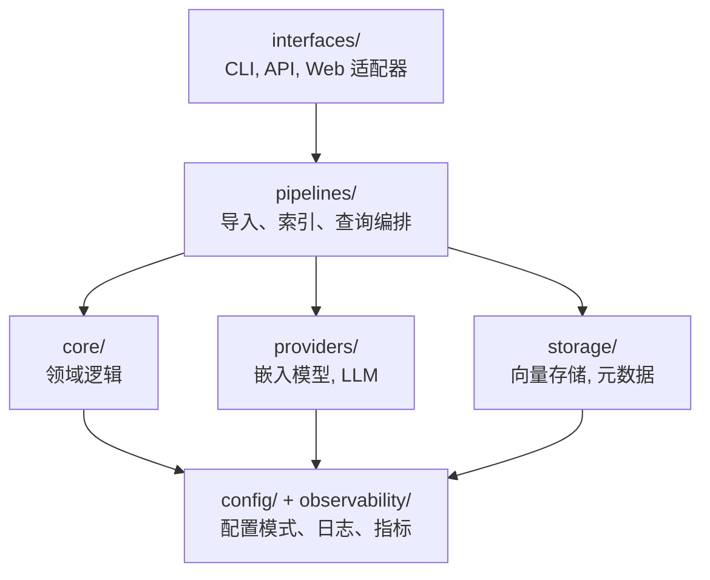

# Memory: 个人知识库系统

一个生产级的个人知识库系统，支持语义搜索和基于 LLM 的问答功能。

## 功能特性

- **语义搜索**: 使用向量相似度查找相关信息
- **LLM 问答**: 提出问题并获得带有来源引用的 AI 生成答案
- **模块化架构**: 可灵活切换嵌入模型、LLM 和向量数据库
- **多种文档类型**: 支持 Markdown、PDF、HTML 和纯文本
- **配置驱动**: 所有行为通过 TOML 配置文件控制
- **类型安全**: 完整的类型提示和 Pydantic 验证
- **生产就绪**: 结构化日志、错误处理和可观测性

## 快速开始

### 安装

```bash
# 克隆仓库
git clone <repository-url>
cd memory

# 使用 uv 安装
uv sync

# 安装可选依赖
uv sync --extra openai --extra chroma
```

### 基本使用

```bash
# 显示系统信息
memory info

# 导入文档
memory ingest /path/to/documents --recursive

# 搜索信息
memory search "你的查询内容" --top-k 10

# 提问
memory ask "文档的主要主题是什么？"
```

## 架构



详细架构文档请参见 [docs/architecture.md](docs/architecture.md)。

## 配置

创建 `config.toml` 文件：

```toml
app_name = "memory"
log_level = "INFO"
data_dir = "~/.memory"

[embedding]
provider = "local"
model_name = "all-MiniLM-L6-v2"
batch_size = 32

[llm]
provider = "openai"
model_name = "gpt-4"
api_key = "${OPENAI_API_KEY}"

[vector_store]
store_type = "chroma"
collection_name = "memory"
persist_directory = "~/.memory/chroma"

[metadata_store]
store_type = "sqlite"
connection_string = "sqlite:///~/.memory/memory.db"

[chunking]
chunk_size = 512
chunk_overlap = 50
min_chunk_size = 100
```

## 开发

### 项目结构

```
memory/
├── src/memory/
│   ├── core/           # 领域模型和逻辑
│   ├── providers/      # 嵌入和 LLM 提供者
│   ├── storage/        # 向量和元数据存储
│   ├── pipelines/      # 导入和查询管道
│   ├── interfaces/     # CLI、API、Web UI
│   ├── config/         # 配置系统
│   └── observability/  # 日志和指标
├── tests/
│   ├── unit/
│   └── integration/
├── docs/
└── pyproject.toml
```

### 运行测试

```bash
uv run pytest
```

### 代码质量

```bash
# 类型检查
uv run mypy src/

# 代码检查
uv run ruff check src/

# 代码格式化
uv run black src/
```

## 扩展系统

### 添加新的嵌入提供者

1. 在 `providers/` 中创建继承自 `EmbeddingProvider` 的新类
2. 实现所有抽象方法
3. 在配置系统中注册
4. 在 `pyproject.toml` 中添加可选依赖

### 添加新的向量存储

1. 在 `storage/` 中创建继承自 `VectorStore` 的新类
2. 实现所有抽象方法
3. 在配置系统中注册
4. 在 `pyproject.toml` 中添加可选依赖

## 许可证

[在此填写您的许可证]
