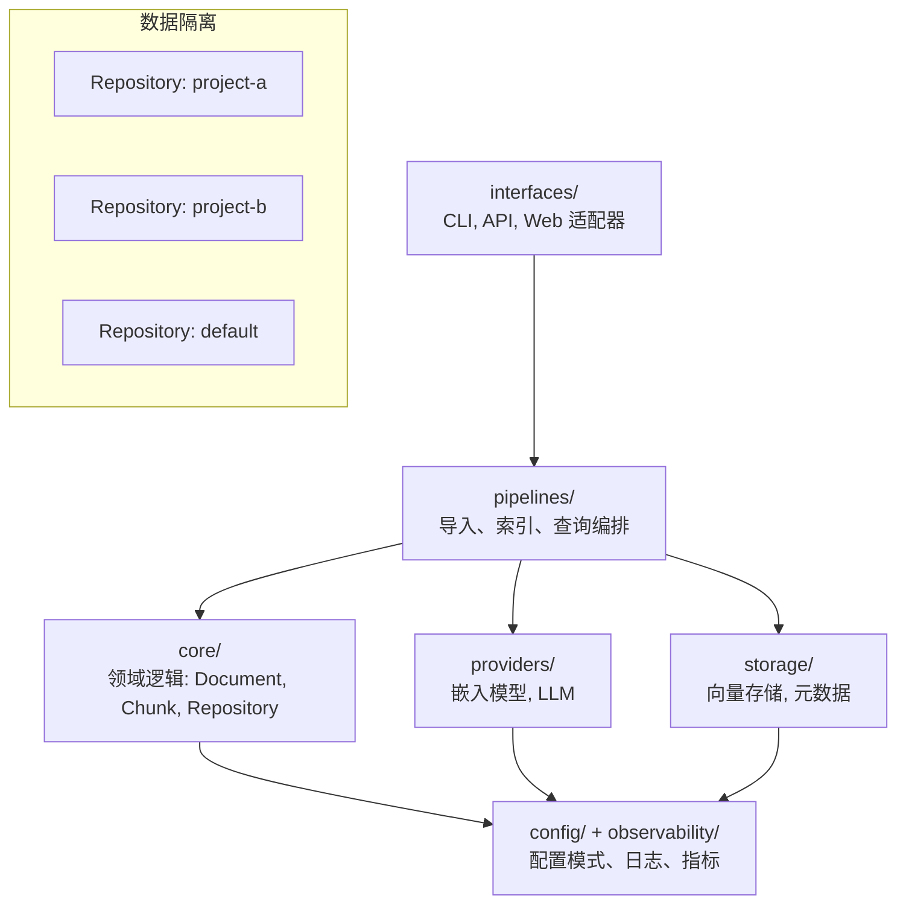

# Memory: 个人知识库系统

一个生产级的个人知识库系统，支持语义搜索和基于 LLM 的问答功能。

## 功能特性

- **仓库隔离**: 使用仓库（Repository）组织和隔离不同项目或主题的文档
- **语义搜索**: 使用向量相似度查找相关信息，支持仓库范围搜索
- **LLM 问答**: 提出问题并获得带有来源引用的 AI 生成答案
- **模块化架构**: 可灵活切换嵌入模型、LLM 和向量数据库
- **多种文档类型**: 支持 Markdown、PDF、HTML 和纯文本
- **配置驱动**: 所有行为通过 TOML 配置文件控制
- **类型安全**: 完整的类型提示和 Pydantic 验证
- **生产就绪**: 结构化日志、错误处理和可观测性

## 快速开始

### 安装

```bash
# 克隆仓库
git clone <repository-url>
cd memory

# 基础安装（仅核心功能）
uv sync

# 根据需要安装可选依赖
# 本地嵌入模型（sentence-transformers）
uv sync --extra local

# OpenAI 嵌入和 LLM
uv sync --extra openai

# ChromaDB 向量存储
uv sync --extra chroma

# 完整安装（推荐）
uv sync --extra local --extra openai --extra chroma
```

**依赖说明**:
- `local`: 本地嵌入模型支持（sentence-transformers），适合离线使用或降低成本
- `openai`: OpenAI API 支持，用于云端嵌入和 LLM
- `chroma`: ChromaDB 持久化向量存储，生产环境推荐

**中国用户加速**:
如果下载 HuggingFace 模型较慢，可以使用镜像：
```bash
export HF_ENDPOINT=https://hf-mirror.com
memory ingest /path/to/documents
```

### 基本使用

```bash
# 显示系统信息
memory info

# 创建仓库
memory repo create my-project --description "我的项目文档"

# 列出所有仓库
memory repo list

# 查看仓库信息
memory repo info my-project

# 导入文档到指定仓库
memory ingest /path/to/documents --repository my-project --recursive

# 在指定仓库中搜索信息
memory search "你的查询内容" --repository my-project --top-k 10

# 在指定仓库中提问
memory ask "文档的主要主题是什么？" --repository my-project

# 删除仓库（会删除所有相关数据）
memory repo delete my-project
```

**注意**: 如果不指定 `--repository` 选项，命令将使用配置文件中的 `default_repository`（默认为 "default"）。

## 架构



### 核心概念

- **Repository（仓库）**: 文档的逻辑隔离单元，每个仓库有独立的向量集合
- **Document（文档）**: 源文档，必须属于一个仓库
- **Chunk（分块）**: 文档片段，继承其父文档的仓库归属
- **Embedding（嵌入）**: 分块的向量表示，按仓库隔离存储

详细架构文档请参见 [docs/architecture.md](docs/architecture.md)。

## 配置

创建 `config.toml` 文件：

### 配置示例 1: 本地部署（完全离线）

```toml
app_name = "memory"
log_level = "INFO"
data_dir = "~/.memory"
default_repository = "default"

[embedding]
provider = "local"
model_name = "all-MiniLM-L6-v2"  # 轻量级，384 维
batch_size = 32

[vector_store]
store_type = "chroma"
collection_name = "memory"

[vector_store.extra_params]
persist_directory = "~/.memory/chroma"

[metadata_store]
store_type = "sqlite"

[metadata_store.extra_params]
connection_string = "sqlite:///~/.memory/memory.db"

[chunking]
chunk_size = 512
chunk_overlap = 50
min_chunk_size = 100
```

### 配置示例 2: OpenAI 云端部署

```toml
app_name = "memory"
log_level = "INFO"
data_dir = "~/.memory"
default_repository = "default"

[embedding]
provider = "openai"
model_name = "text-embedding-3-small"  # 1536 维，性价比高
api_key = "${OPENAI_API_KEY}"
batch_size = 100

[llm]
provider = "openai"
model_name = "gpt-4"
api_key = "${OPENAI_API_KEY}"

[vector_store]
store_type = "chroma"
collection_name = "memory"

[vector_store.extra_params]
persist_directory = "~/.memory/chroma"

[metadata_store]
store_type = "sqlite"

[metadata_store.extra_params]
connection_string = "sqlite:///~/.memory/memory.db"

[chunking]
chunk_size = 512
chunk_overlap = 50
min_chunk_size = 100
```

### 嵌入提供者配置

#### 本地嵌入（sentence-transformers）

```toml
[embedding]
provider = "local"
model_name = "all-MiniLM-L6-v2"  # 可选模型见下表
batch_size = 32
```

**支持的模型**:
| 模型名称 | 维度 | 大小 | 速度 | 质量 | 适用场景 |
|---------|------|------|------|------|---------|
| all-MiniLM-L6-v2 | 384 | 80MB | 快 | 中 | 快速原型、资源受限 |
| all-mpnet-base-v2 | 768 | 420MB | 中 | 高 | 通用推荐 |
| paraphrase-multilingual-MiniLM-L12-v2 | 384 | 420MB | 快 | 中 | 多语言支持 |

#### OpenAI 嵌入

```toml
[embedding]
provider = "openai"
model_name = "text-embedding-3-small"  # 可选模型见下表
api_key = "${OPENAI_API_KEY}"
batch_size = 100
```

**支持的模型**:
| 模型名称 | 维度 | 价格 | 性能 | 适用场景 |
|---------|------|------|------|---------|
| text-embedding-3-small | 1536 | $0.02/1M tokens | 高 | 性价比首选 |
| text-embedding-3-large | 3072 | $0.13/1M tokens | 最高 | 高精度需求 |
| text-embedding-ada-002 | 1536 | $0.10/1M tokens | 高 | 旧版兼容 |

### 向量存储配置

#### ChromaDB（持久化存储）

```toml
[vector_store]
store_type = "chroma"
collection_name = "memory"

[vector_store.extra_params]
persist_directory = "~/.memory/chroma"  # 数据持久化目录
```

**特性**:
- 自动持久化到磁盘
- 支持仓库隔离（每个仓库独立集合）
- 高效的相似度搜索
- 支持元数据过滤

#### 内存存储（开发/测试）

```toml
[vector_store]
store_type = "memory"
collection_name = "memory"
```

**注意**: 内存存储仅用于开发和测试，数据不会持久化。

### 元数据存储配置

#### SQLite（推荐）

```toml
[metadata_store]
store_type = "sqlite"

[metadata_store.extra_params]
connection_string = "sqlite:///~/.memory/memory.db"
```

#### 内存存储（开发/测试）

```toml
[metadata_store]
store_type = "memory"
```

### 环境变量

所有配置项都可以通过环境变量覆盖，使用 `MEMORY_` 前缀：

```bash
export MEMORY_DEFAULT_REPOSITORY="my-project"
export MEMORY_LOG_LEVEL="DEBUG"
export MEMORY_EMBEDDING__PROVIDER="openai"
export MEMORY_EMBEDDING__API_KEY="sk-..."
```

## 开发

### 项目结构

```
memory/
├── src/memory/
│   ├── core/           # 领域模型和逻辑
│   │   ├── models.py       # Document, Chunk, Repository, Embedding
│   │   ├── chunking.py     # 文本分块逻辑
│   │   └── repository.py   # 仓库管理器
│   ├── providers/      # 嵌入和 LLM 提供者
│   ├── storage/        # 向量和元数据存储
│   │   ├── base.py         # 抽象接口
│   │   ├── memory.py       # 内存实现
│   │   └── sqlite.py       # SQLite 实现
│   ├── pipelines/      # 导入和查询管道
│   ├── interfaces/     # CLI、API、Web UI
│   ├── config/         # 配置系统
│   └── observability/  # 日志和指标
├── tests/
│   ├── unit/
│   └── integration/
├── docs/
└── pyproject.toml
```

### 运行测试

```bash
uv run pytest
```

### 代码质量

```bash
# 类型检查
uv run mypy src/

# 代码检查
uv run ruff check src/

# 代码格式化
uv run black src/
```

## 使用示例

### 示例 1: 导入和搜索本地文档

```bash
# 创建仓库
memory repo create docs --description "项目文档"

# 导入 Markdown 文件
memory ingest ./docs --repository docs --recursive

# 搜索相关内容
memory search "如何配置系统？" --repository docs --top-k 5

# 查看搜索结果
# 返回最相关的 5 个文档片段及其相似度分数
```

### 示例 2: 使用 OpenAI 进行问答

```bash
# 配置 OpenAI API
export OPENAI_API_KEY="sk-..."

# 提问（会自动检索相关文档并生成答案）
memory ask "系统的主要功能是什么？" --repository docs

# 输出包含：
# - 生成的答案
# - 引用的源文档
# - 相关分块的相似度分数
```

### 示例 3: 管理多个仓库

```bash
# 创建多个仓库
memory repo create project-a --description "项目 A"
memory repo create project-b --description "项目 B"

# 列出所有仓库
memory repo list

# 查看仓库统计信息
memory repo info project-a

# 为不同仓库导入不同文档
memory ingest ./project-a-docs --repository project-a
memory ingest ./project-b-docs --repository project-b

# 在特定仓库中搜索
memory search "功能" --repository project-a
memory search "功能" --repository project-b

# 删除仓库（包括所有数据）
memory repo delete project-a
```

## 故障排除

### 问题 1: HuggingFace 模型下载超时

**症状**: 首次运行时卡在下载模型，或出现网络超时错误

**解决方案**:
```bash
# 使用 HuggingFace 镜像（中国用户推荐）
export HF_ENDPOINT=https://hf-mirror.com
memory ingest ./documents

# 或者手动下载模型
python -c "from sentence_transformers import SentenceTransformer; SentenceTransformer('all-MiniLM-L6-v2')"
```

### 问题 2: ChromaDB 集合名称错误

**症状**: `ValueError: Collection name contains invalid characters`

**解决方案**:
- 集合名称只能包含字母、数字、下划线和连字符
- 不能以数字开头
- 修改 `config.toml` 中的 `collection_name`

```toml
[vector_store]
collection_name = "my_memory"  # 正确
# collection_name = "123-memory"  # 错误：以数字开头
```

### 问题 3: OpenAI API 认证失败

**症状**: `AuthenticationError: Invalid API key`

**解决方案**:
```bash
# 检查 API 密钥
echo $OPENAI_API_KEY

# 确保密钥正确设置
export OPENAI_API_KEY="sk-..."

# 或在 config.toml 中设置
[embedding]
api_key = "sk-..."
```

### 问题 4: 内存不足

**症状**: 导入大文件时出现内存错误

**解决方案**:
- 减小 `batch_size`
- 分批导入文件
- 增加系统内存

```toml
[embedding]
batch_size = 8  # 从 32 降低到 8
```

### 问题 5: 搜索结果不相关

**症状**: 搜索返回的结果与查询不匹配

**解决方案**:
- 调整 `chunk_size` 和 `chunk_overlap`
- 使用更好的嵌入模型
- 增加 `top-k` 参数查看更多结果

```toml
[chunking]
chunk_size = 256  # 减小块大小以获得更精细的粒度
chunk_overlap = 50

[embedding]
model_name = "all-mpnet-base-v2"  # 使用更强大的模型
```

### 问题 6: 数据库锁定错误

**症状**: `database is locked` 错误

**解决方案**:
- 确保没有多个进程同时访问数据库
- 检查 `~/.memory/memory.db` 是否被其他进程占用
- 重启应用

```bash
# 检查是否有其他进程在使用数据库
lsof ~/.memory/memory.db

# 如果需要，删除锁文件
rm ~/.memory/memory.db-wal
rm ~/.memory/memory.db-shm
```

## 扩展系统

### 添加新的嵌入提供者

1. 在 `providers/` 中创建继承自 `EmbeddingProvider` 的新类
2. 实现所有抽象方法
3. 在配置系统中注册
4. 在 `pyproject.toml` 中添加可选依赖

### 添加新的向量存储

1. 在 `storage/` 中创建继承自 `VectorStore` 的新类
2. 实现所有抽象方法
3. 在配置系统中注册
4. 在 `pyproject.toml` 中添加可选依赖

## 许可证

[在此填写您的许可证]
